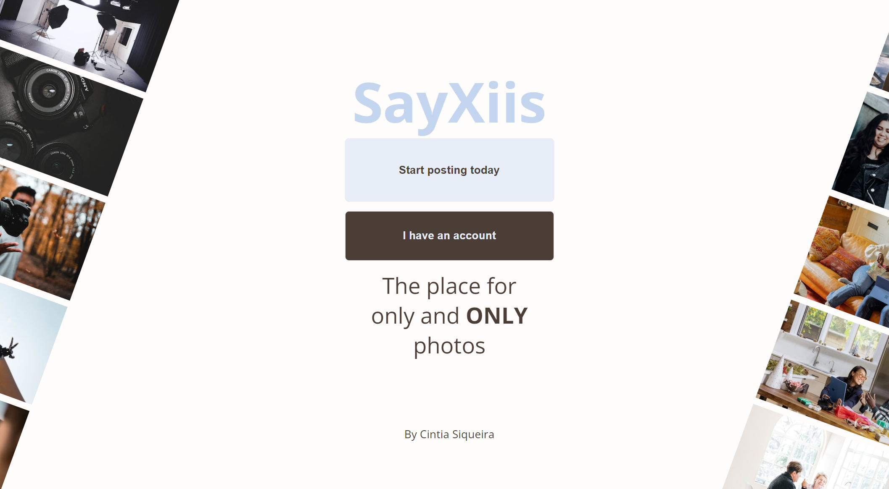

# Sayxiis

"App about photos for who like **ONLY** photos and competions."



#### Wireframes:

[Low-fidelity Figma](https://www.figma.com/file/m88ZyfM1Bkx4mgOfWqPdek/SayXiis-solo-project?type=design&node-id=0%3A1&mode=design&t=AZvoWwraqKkxfS0B-1)<br>
[High-fidelity Figma](https://www.figma.com/file/YVVJ8opqaaTJLIEYIc5Mco/High-fidelity---Wireframe-Sayxiis?type=design&node-id=0-1&mode=design&t=7JUodlwObu6HdvZn-0)

### What is Sayxiis?

It is a app for who is tired for not be able to see anymore only photos on instagram or the photographers that you like. You can’t see any more their work because of the all random people with short videos came trying to seduce you. In this app you will be allowed only post photos, have a profile with your photos and the most fun part, it will have some kind of small competion like: “today only sky photos” and with tags and ranks (people will be able to vote in the photos) you can have fun doing it with others. Also I want at the end of the "day tag" (will reset at the midnight) the person with more votes get a "win sticker" that will show in their profile and everyone can compete to have a sticker and have fun posting a day tag photo.

## Back End

### Tecnologies used:

- NodeJS v18.16.0
- Postgree v6.0.5
- Express
- Sequalize
  <br>

### ⚠️ Installation Guide ⚠️

- Run "npm install" to install all dependencies

```bash
npm i
```

- You need to have node and Postgree installed
- Create an .env file in your project root folder and add your variables.
  <br>

### Creating User x

You need to have 1 user for the app run
(For now I don't have the implementation for the others users, if you put more than one user will break, yeah I need to make the getUserByID instead of getAllUsers)

```{
  "username": "User x",
  "email": "userx@email.com",
  "password": 123,
  "profilePicture": "https://images.unsplash.com/photo-1544005313-94ddf0286df2?ixlib=rb-4.0.3&ixid=M3wxMjA3fDB8MHxwaG90by1wYWdlfHx8fGVufDB8fHx8fA%3D%3D&auto=format&fit=crop&w=2188&q=80",
  "name": "User",
  "surname": "X",
  "intro": "User testing - Photos"
}
```

### Creating .env file

```{
DB_NAME=sayxdb - name of database Need be this one
DB_USER=postgres - Your username from Postgres
DB_PASSWORD=Yourpasswordhere -  Your password from postgress
DB_HOST=localhost  - Leave this likes this
DB_DIALECT=postgres  - Leave this likes this
DB_PORT=5432  - Leave this likes this
}
```

### Usage

- go to cd server
- Run "nodemoon index.js" to start the application.

```bash
nodemon  index.js
```

- Connect to the API using Postman on port 5432 (http://localhost:5432).
  <br><br>

## Front End:

This is a [React.js](https://react.dev/learn) project with [`npm create vite@latest`](https://vitejs.dev/guide/).

## Getting Started

1 - Go to the folder

```bash
cd client
cd sayxiis
```

2 - Create a .env file:

```
# Cloudinary:
VITE_APP_CLOUD_KEY=You key from cloudinary
# Unsplash:
VITE_APP_API_KEY=Your key from unsplash
```

2 - install all the dependencies

```bash
npm i
```

3 - Run the app

```bash
npm run dev
```

The app run one "http://localhost:5173/"

### Documentations

**Backend**

- [Download NodeJs](https://nodejs.org/en/download)
- [Download postgres](https://www.postgresql.org/)
- [Sequalize](https://sequelize.org/docs/v6/getting-started/)
- [Express](https://expressjs.com/en/starter/installing.html)<br>

**Frontend**

- [React](https://react.dev/)
- [Api unsplash](https://unsplash.com/developers)
- [Cloudinary](https://cloudinary.com/)
